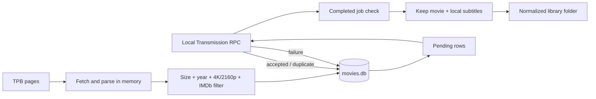

# hd-movies 3.0 design

## Scope and placement

Version 3.0 runs in the same jail as Transmission. This is intentional: it needs local access to the download root in order to produce a clean library folder after a torrent completes. It talks to the local Transmission RPC endpoint using only an IP address and port; no username or password is supported or needed for the stated setup.

The service does not search for, download, unpack, or otherwise acquire subtitles. It preserves subtitle files that are already present in a completed torrent alongside the selected movie file.

## Module boundaries

| Module | Responsibility |
| --- | --- |
| `app` | Service loop, one-cycle workflow, and pending-torrent delivery. |
| `cli` | Flags and environment-backed configuration. |
| `feed` | HTTP fetch/retry, TPB parsing, title normalization, and advertised-size extraction. |
| `filter` | Download eligibility rules, IMDb title resolution, and IMDb-score lookup. |
| `db` | Durable release state, retry diagnostics, queue export, and legacy migration. |
| `transmission` | Standard `409` session-ID handshake and RPC methods. |
| `organizer` | Safe local selection, naming, moving, rollback, and source cleanup. |

## Cycle flow



On a normal service cycle, the organizer runs first, then the feeds are scanned and new pending releases are sent to Transmission. The service starts with an immediate cycle and sleeps for `interval_seconds` before the next one. `--once` runs one cycle. `--first-run` is always one-shot and skips all Transmission and file-organizer actions.

## Feed processing

The built-in source URLs are the legacy TPB HD-movie top and seed-order pages. Pages stay in memory; the service does not create `web_data` or other scrape files.

The parser recognizes both:

- the current TPB table layout, which uses a title anchor beginning with `Details for` and a magnet link;
- the old `.detName`/`.detLink` layout used by the Python script.

Names are normalized by replacing each run of non-alphanumeric characters with one space. The current TPB table's advertised file size is extracted from its row; the legacy parser also recognizes `MiB`/`GiB` size text. An unparseable size is retained as an incomplete candidate but cannot pass the download filter.

Each source is retried up to three times. If every source fails, no SQLite database is opened and no new torrent is queued. A successful response that produces no recognizable torrent rows emits a warning so a TPB layout change cannot silently look like an empty update.

## Movie filter

`filter` is intentionally separate from TPB parsing and from Transmission delivery. A candidate is eligible only when all conditions below are true:

1. Its advertised torrent size is strictly greater than `minimum_torrent_size_mib` (500 MiB by default).
2. Its name contains a configured release year; by default, that is the local calendar year or the preceding year.
3. Its name contains a `4K` or `2160p` resolution token.
4. Its exact normalized title and year resolve to an IMDb movie and the returned IMDb score is strictly greater than `minimum_imdb_score` (6.0 by default).

The filter removes release-group text by taking the normalized words before the matching year, resolves the IMDb ID with IMDb's public suggestion endpoint, and retrieves the `imdbRating` for that exact ID through the Cinemeta movie-metadata endpoint. It does not guess when a title or year is ambiguous. Ratings are cached in memory for the duration of a scan, so multiple release variants of one title use one lookup. Missing metadata, unavailable services, invalid scores, and scores at or below the threshold all fail closed: the torrent is not recorded or queued. Verbose mode reports the individual rejection reason, while each cycle prints aggregate filter counts.

## SQLite state

`movies.db` is the durable queue and historical record. It contains:

| Field | Meaning |
| --- | --- |
| `name` | Normalized title; primary key. |
| `url` | Magnet or `.torrent` URL. |
| `first_seen_at` | Discovery time. |
| `status` | `baseline`, `pending`, or `queued`. |
| `queued_at` | Time Transmission accepted the URL. |
| `attempts`, `last_error` | Durable retry diagnostics. |

New releases are inserted transactionally. A normal discovery becomes `pending`; a first-run discovery becomes `baseline`. A successful `torrent-add` response—including Transmission's duplicate response—marks it `queued`. Failures leave it `pending`, save the error, and retry it on the next cycle.

Legacy Python databases are migrated in place: missing state columns are added and existing `MOVIES(name, url)` records become `queued`, avoiding accidental replay of historical downloads.

`--queue-file` is an optional compatibility export only. It is not part of the durable workflow.

## Transmission contract

The endpoint is constructed as:

```text
http://<transmission-ip>:<transmission-port>/transmission/rpc
```

The client handles Transmission's required `409 Conflict` session-ID exchange before invoking `session-get`, `torrent-get`, `torrent-add`, or `torrent-remove`. `--check-transmission` invokes only `session-get` and is safe to use as a deployment health check.

The configured download root must be a local directory visible to both the Rust service and Transmission. Every new release gets a normalized child folder under that root. This folder-per-job rule is the boundary that permits later cleanup without risking arbitrary downloads.

## Completed-download organization

Supplying `--library-dir` enables the organizer. The library and download root must be separate directory trees. For every complete torrent whose `downloadDir` is a direct child of the managed root, the organizer:

1. Recursively finds movie files with extensions `mkv`, `mp4`, or `avi` at or above the configured size threshold, then chooses the largest.
2. Collects existing `srt`, `ass`, `ssa`, `sub`, and `vtt` files.
3. Creates `<library>/<normalized title>/`.
4. Names the movie `<normalized title>.<original-extension>` and subtitles `<normalized title>.<label>.<extension>`.
5. Moves the selected files. Same-filesystem moves use `rename`; a cross-filesystem move uses one temporary `.part` file, syncs it, then renames it into place.
6. Removes the torrent from Transmission without asking Transmission to delete local data.
7. Deletes the original per-job download directory, which removes all unselected artifacts such as samples, images, NFO files, archives, and tracker leftovers.

The order protects data: source deletion happens only after files move and Transmission confirms removal. If a file move or RPC removal fails, the organizer attempts to move already moved files back. Existing destination folders are never overwritten and cause the job to be skipped for manual review.

Only managed direct-child folders are eligible. A torrent using the download root itself, an outside path, or an incomplete stopped state is never deleted by the organizer.

## Footprint and deployment

The release profile enables thin LTO and strips symbols. SQLite is bundled and Rustls avoids an OpenSSL runtime dependency. At runtime the intentional persistent files are the executable, `movies.db`, the optional log, and an optional explicit queue export. Temporary `.part` files arise only while copying a media file across filesystems and are removed on success or copy failure.

Build for the target FreeBSD architecture, deploy the release binary, and install the supplied `packaging/freebsd/hd_movies` rc.d wrapper. For this development checkout, the FreeBSD 13.1 sysroot, base archive, and Zig linker wrapper live in the Git-ignored `.freebsd13-build/` cache. `./scripts/build-freebsd13.sh` reuses that cache to build an amd64 TrueNAS CORE 13 binary without re-downloading the base archive; the cache is intentionally local and path-specific.

## Tests

Unit tests cover title normalization, TPB size parsing, filter decisions, IMDb response parsing, SQLite migration/state, RPC endpoint construction, and movie/subtitle output naming. Ignored live integration tests fetch both current default TPB pages and resolve a known IMDb score. Run them explicitly with `cargo test -- --ignored`.
